<p align="center">
  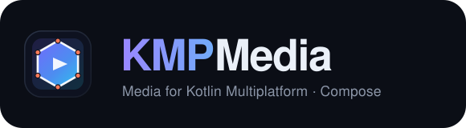
</p>

# KMPMedia

**A Kotlin Multiplatform media library for Compose** — with a focus on **animated, interactive, and runtime-editable vector SVG**, plus image processing, **animated GIFs**, audio, and video, on **Android and iOS**.

Everything renders into native Compose primitives (`Canvas`/`drawScope`), so SVGs are live vectors you can animate, drag, layer, and edit at runtime — not rasterized bitmaps.

---

## Why KMPMedia?

Basic "show an SVG on both platforms" is now a solved problem (Coil 3, Kamel, Compose Multiplatform resources). KMPMedia targets what those still don't do:

| Capability | KMPMedia | Coil 3 (`coil-svg`) | Compose MP resources |
|---|:---:|:---:|:---:|
| Cross-platform SVG (Android + iOS) | ✅ | ✅ | ⚠️ (not Android) |
| Rendered as **live vectors** (not a bitmap) | ✅ | ❌ (rasterized) | ❌ |
| **Runtime SVG animation** (SMIL `<animate>`) | ✅ | ❌ | ❌ |
| **Wrap any static image/SVG → animated** (`OGAnimatedImage`) | ✅ | ❌ | ❌ |
| **Shape-crop** image & video to any shape (circle/triangle/…) | ✅ | ❌ | ❌ |
| **Free-form polygon lasso** — clip to any AI-/hand-drawn outline (`OGPolygonShape`) | ✅ | ❌ | ❌ |
| **Depth / layer management** — fly over/under + depth-of-field blur (`Modifier.ogDepth`) | ✅ | ❌ | ❌ |
| **Interactive / draggable / gesture** layers | ✅ | ❌ | ❌ |
| Bundled image + audio + video suite | ✅ | ❌ | ❌ |

If all you need is a static SVG loaded from the network, a general image loader is the simpler choice. Reach for KMPMedia when you need the SVG to **move, respond, or change at runtime**.

---

## AI-friendly by design

KMPMedia is built to be **generated correctly by AI coding assistants**, not just written by hand:

- **It speaks SVG** — the one graphics format LLMs produce natively as text. An assistant can emit an `<svg>` (including the animated SMIL subset) or a URL, and KMPMedia renders *and animates* it live on both platforms.
- **Declarative, consistent API** — every entry point is `OG…`, and you describe *what* (a shape, an animation set, a cue at a timestamp, a depth) as data. Generated code compiles more often and hallucinates less surface.
- **Agent-ready docs in the repo** — a machine-readable [`llms.txt`](llms.txt) API index and an [AI coding guide](docs/AI_GUIDE.md) with prompt→snippet examples.

Today that makes KMPMedia **AI-generatable**. A serializable scene-spec + MCP server (an LLM emits validated *data*, not Kotlin, and previews it before writing code) are on the roadmap to make it fully **AI-ready**.

---

## See it running — the demo app

KMPMedia ships with a full **Compose Multiplatform demo app** (Android + iOS) built directly against this library's source, so every screen is real, readable library code you can lift into your own app. It's the fastest way to see what "animated, interactive, runtime-editable" actually looks like.

<p align="center">
  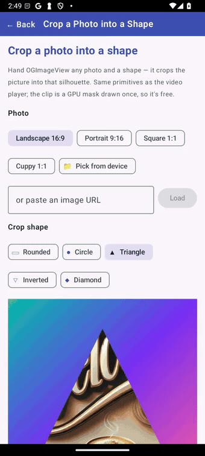
</p>
<sub><b>The core moves, live.</b> Crop a photo into any shape · re-frame a <i>running</i> video into any shape · bring a 100%-static SVG to life with Scale / Rotate / Fade / Slide. Each is one <code>OGImageView</code> / <code>OGAVPlayer</code> / animation-primitive call — the same Compose Multiplatform code on Android &amp; iOS.</sub>

And the flagship **runtime-editable SVG** — one `.svg` parsed *once*, then any node changed by its `id` at runtime, bound to Compose state:

<p align="center">
  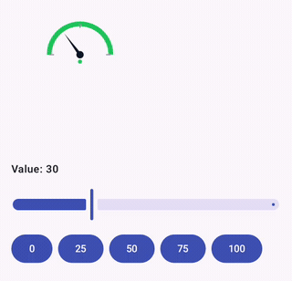
  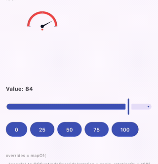
</p>
<sub><b>Runtime-editable SVG, live — Android (left) &amp; iOS (right).</b> One <code>.svg</code> is parsed <i>once</i>; a slider only mutates an <code>overrides</code> map keyed by node <code>id</code> and the same drawing redraws live — the needle rotates and the arc + status dot recolour green→amber→red. No re-parse, identical on both platforms. See <a href="docs/RUNTIME_SVG.md">docs/RUNTIME_SVG.md</a>.</sub>

And a whole mini-game built from those same primitives:

<p align="center">
  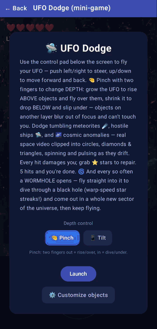
  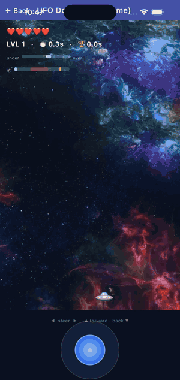
</p>
<sub><b>UFO Dodge, live — Android (left) &amp; iOS (right).</b> The <i>same</i> Compose Multiplatform code on both: a real looping video clipped into the backdrop, SVG sprites animated by the library, and the video's own timeline firing an in-game meteor-storm cue.</sub>

And **animated GIFs** — one `OGImageView` pointed at a `.gif`, playing on both platforms (and clipped into shapes just like a still photo):

<p align="center">
  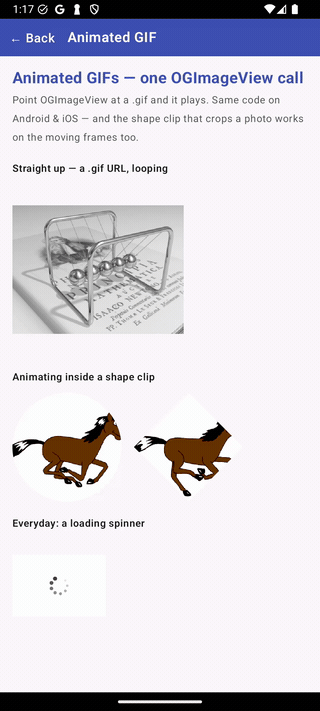
  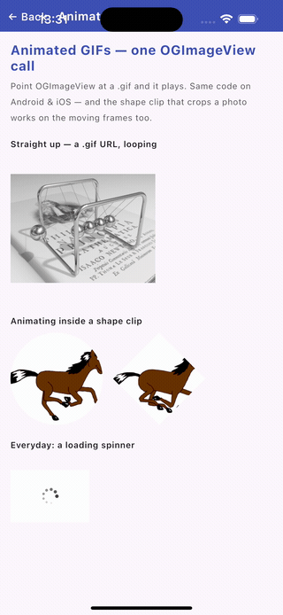
</p>
<sub><b>Animated GIF, live — Android (left) &amp; iOS (right).</b> Each GIF is one <code>OGImageView</code> pointed at a <code>.gif</code> URL — it auto-detects and loops the frames (Android <code>AnimatedImageDrawable</code>, iOS Skia <code>Codec</code>). The <i>same</i> shape clip that crops a still photo animates the moving frames inside a circle / diamond too. See <a href="docs/GIF.md">docs/GIF.md</a>.</sub>

<p>
  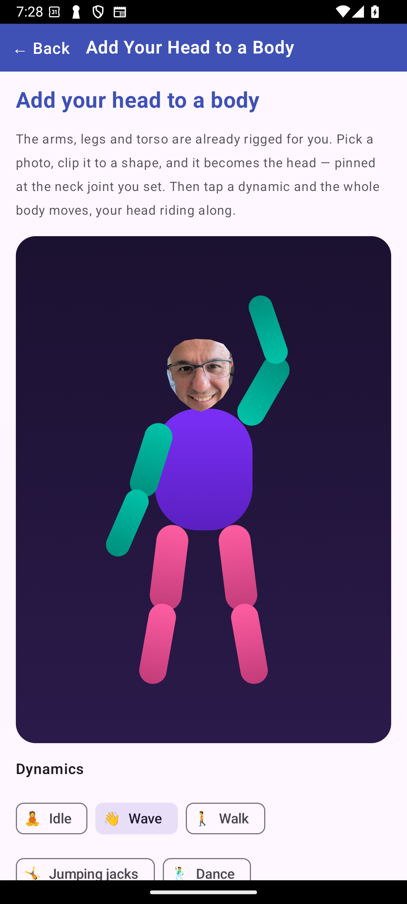
  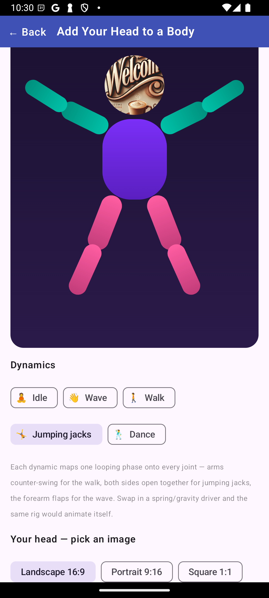
  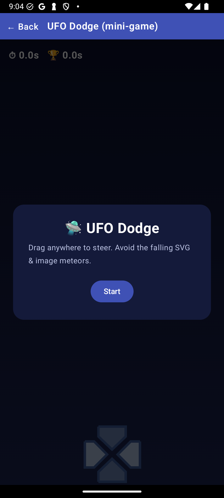
</p>
<sub><b>Android</b> — “Add Your Head to a Body”, then UFO Dodge.</sub>

<p>
  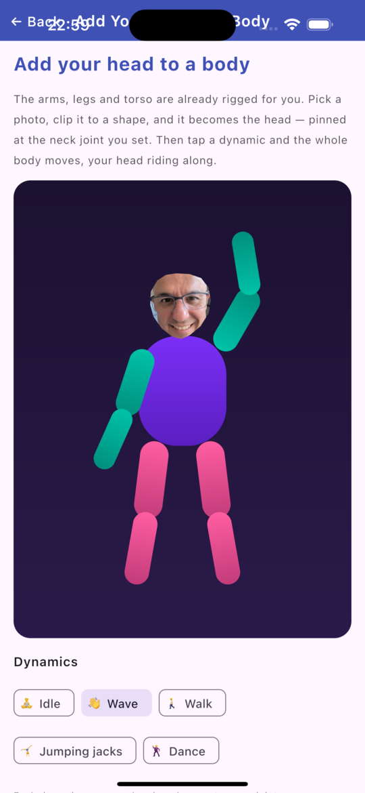
  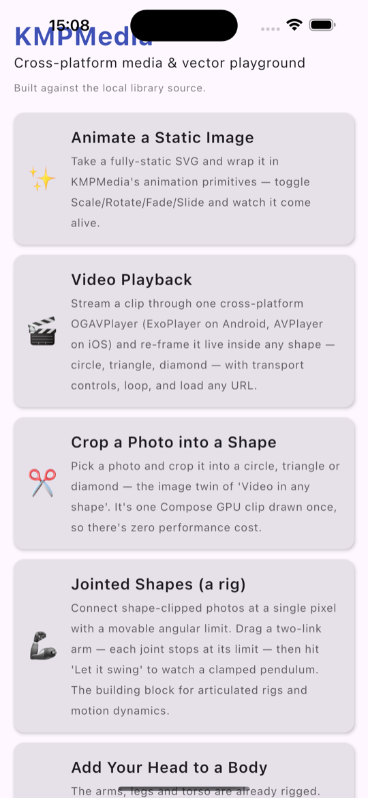
  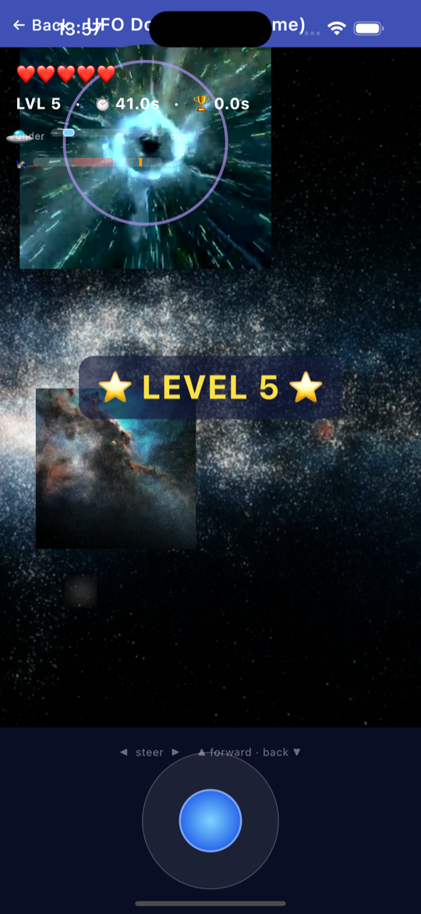
  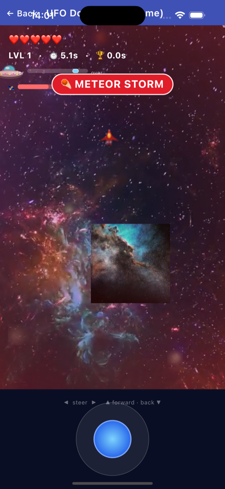
</p>
<sub><b>iOS</b> — the same Compose Multiplatform code on an iPhone simulator: <b>“Add Your Head to a Body”</b> (your photo cut out by the <code>OGPolygonShape</code> head-lasso, exactly as on Android), the home menu, then UFO Dodge (black-hole warp + a meteor-storm cue).</sub>

**What's inside**

- **✨ Animate a Static Image** — take a fully-static SVG (zero `<animate>` tags) and bring it alive with the animation primitives: Scale / Rotate / Fade / Slide, combined live.
- **🎨 Runtime-editable SVG** — load an SVG once, then change any node by `id` at runtime — recolour, rotate, move — bound to Compose state ([`OGSvgNodeOverride`](docs/RUNTIME_SVG.md)). A live gauge whose needle and zones follow a slider, no re-parse. "SVG as a live template", identical on Android & iOS.
- **✂️ Crop a Photo into a Shape** — crop any photo into a circle / triangle / diamond with pinch-to-zoom, drag-to-pan and a 3×3 focal grid — one GPU clip, drawn once, so it's free.
- **🧍 Add Your Head to a Body** — an *already-rigged* body (torso + two arms + two legs, every segment a jointed chain). Drop in a photo and the **✂️ head lasso** ([`OGPolygonShape`](docs/POLYGON_SHAPE.md)) clips out *just the head* — no external editor — pinned at the neck joint you set (size + tilt); or fall back to a circle / triangle / diamond. Then tap **Wave / Walk / Jumping jacks / Dance** and the whole body animates, your head riding along. The head is one `OGImageView` clip; the rig and every dynamic are plain Compose, identical on Android & iOS.
- **🦾 Jointed Shapes** — the building block behind it: shape-clipped photos pinned at one pixel with a movable angular limit, chained into a draggable two-link arm and a clamped pendulum.
- **🎞️ Animated GIF** — point one `OGImageView` at a `.gif` and it plays: looping frames on Android (`AnimatedImageDrawable`) and iOS (Skia `Codec`), the same code. The shape clip that crops a photo animates the moving frames inside a circle / diamond too.
- **🎬 Video Playback** — one cross-platform `OGAVPlayer` (ExoPlayer on Android, AVPlayer on iOS), re-framed live into any shape, with transport controls, loop and load-any-URL.
- **🛸 UFO Dodge (mini-game)** — every sprite is a static SVG animated by the library; crop your own photos into shapes and drop them into the field as live game objects.
- **🎛️ Playground · 🧪 Edge Cases · ⚡ Performance** — load anything from any URL/resource and tune every config live; deliberately broken inputs that prove `onError` fires cleanly; and load-timing / many-layer stress benchmarks with live numbers.

**Run it** — the demo lives in its own [companion repo](https://github.com/SolidKeyAB/kmpmedia-demo) and consumes this library via [`includeBuild`](#use-it-today-from-source):

- **Android** — `./gradlew :androidApp:assembleDebug`, install the APK, or open it in Android Studio. Prebuilt APKs are on the demo repo's [**Releases** page](https://github.com/SolidKeyAB/kmpmedia-demo/releases).
- **iOS** — open the Xcode project and run; a run-script phase recompiles the shared KMP framework on every build, so library changes flow straight through.

## Supported platforms

- ✅ **Android** (`minSdk` per catalog, compiled against JDK 17)
- ✅ **iOS** (`iosArm64`, `iosSimulatorArm64`)

> ℹ️ There are no JVM-desktop, web, or Linux targets in this build.

---

## Installation

> ✅ **Available on Maven Central.** Add the coordinate below and you're set. If you'd rather build against the library source (or need an unreleased change), see [`includeBuild`](#use-it-today-from-source) or GitHub Packages below.

KMPMedia is a Compose Multiplatform library. In your **`settings.gradle.kts`**, make sure the Compose dev repo is available alongside the usual repositories:

```kotlin
dependencyResolutionManagement {
    repositories {
        google()
        mavenCentral()
        maven("https://maven.pkg.jetbrains.space/public/p/compose/dev")
    }
}
```

Then add the dependency to your shared module's **`commonMain`**:

```kotlin
kotlin {
    sourceSets {
        commonMain.dependencies {
            implementation("se.solidkey:kmpmedia-lib:1.2.0")
        }
    }
}
```

<details>
<summary>Alternative: GitHub Packages</summary>

Add the GitHub Packages repository (requires a GitHub token with `read:packages`):

```kotlin
// settings.gradle.kts
dependencyResolutionManagement {
    repositories {
        maven("https://maven.pkg.github.com/SolidKeyAB/kmpmedia") {
            credentials {
                username = providers.gradleProperty("gpr.user").orNull ?: System.getenv("GPR_USER")
                password = providers.gradleProperty("gpr.key").orNull ?: System.getenv("GPR_TOKEN")
            }
        }
    }
}
```
</details>

<details id="use-it-today-from-source">
<summary>Alternative: build from source (<code>includeBuild</code>)</summary>

To hack on the library itself or consume an unreleased change, depend on a local checkout instead of Maven Central — this is exactly how the demo app uses it:

```kotlin
// settings.gradle.kts of the consuming project
includeBuild("../KMPMedia") // path to your local clone
```
```kotlin
// consuming module's build.gradle.kts
commonMain.dependencies {
    implementation("se.solidkey:kmpmedia-lib")
}
```
</details>

---

## Quick start

### Render an SVG

```kotlin
import com.solidkey.painpoints.image.svg.OGSVGView
import com.solidkey.painpoints.image.loading.OGSvgUrlType

OGSVGView(
    source = OGSvgUrlType("https://example.com/logo.svg"),
    width = 240f,
    height = 240f,
    onError = { message -> /* handle load/parse errors */ },
)
```

Sources can also be local files or bundled resources:

```kotlin
OGSvgFileType("/path/to/icon.svg")
OGSvgResourceFileType("icon.svg")
```

### Animate an SVG (SMIL `<animate>`)

```kotlin
import com.solidkey.painpoints.image.svg.animation.OGSVGAnimationPlayer

OGSVGAnimationPlayer(
    source = OGSvgResourceFileType("spinner.svg"),
    width = 120f,
    height = 120f,
    isPlaying = true,
    loop = true,
    onError = { /* ... */ },
)
```

### Turn any static image into an animated one

`OGAnimatedImage` wraps any source — a photo, or even a plain SVG with **no** `<animate>` tags — and animates it at runtime. The source file is never modified; the motion comes entirely from the wrapper.

```kotlin
import com.solidkey.painpoints.image.animating.OGAnimatedImage
import com.solidkey.painpoints.image.animating.OGAnimationType
import com.solidkey.painpoints.image.loading.OGImageUrlType

OGAnimatedImage(
    source = OGImageUrlType("https://example.com/logo.png"),
    animations = setOf(OGAnimationType.SCALE, OGAnimationType.ROTATE), // SCALE / ROTATE / FADE / TRANSLATE
    durationMillis = 1200,
    intensity = 1f,
    onError = { /* ... */ },
)
```

### Display and transform an image

```kotlin
import com.solidkey.painpoints.image.OGImageView
import com.solidkey.painpoints.image.loading.OGImageUrlType

OGImageView(
    source = OGImageUrlType("https://example.com/photo.jpg"),
    draggable = true,
    onEventTriggered = { event, id -> /* layer interaction events */ },
    onError = { /* ... */ },
)
```

Crop the photo into a shape (circle, triangle, diamond, …) with a GPU clip — drawn once, no bitmap cost:

```kotlin
import androidx.compose.foundation.layout.size
import androidx.compose.ui.Alignment
import androidx.compose.ui.layout.ContentScale
import androidx.compose.ui.unit.dp
import com.solidkey.painpoints.shape.OGShapeType

OGImageView(
    source = OGImageUrlType("https://example.com/portrait.jpg"),
    modifier = Modifier.size(220.dp),
    displayShape = OGShapeType.CIRCLE,   // CIRCLE / TRIANGLE_UP / TRIANGLE_DOWN / DIAMOND / SQUARE / RECTANGLE
    contentScale = ContentScale.Crop,
    alignment = Alignment.TopCenter,     // which region stays visible when the photo is over-scaled
    onEventTriggered = { _, _ -> },
    onError = { /* ... */ },
)
```

> The same shape-crop applies to video — a built-in shape via `OGAVPlayer(config = OGPlayerConfig(displayShape = OGShapeType.CIRCLE))`, or a **free-form lasso** via `OGPlayerConfig(clipShape = OGPolygonShape.of(...))` (the same `clipShape` override as images).

Need to keep only an *arbitrary* region — a head, a logo, a hand-drawn area? Clip to a **free-form polygon lasso** instead of a built-in shape. The outline is just a list of normalized `0..1` vertices joined by line segments, so an AI/segmentation model or an on-image finger-draw can produce it directly — no external editor:

```kotlin
import com.solidkey.painpoints.shape.OGPolygonShape

OGImageView(
    source = OGImageResourceFileType("portrait", OGImageFormat.JPEG),
    modifier = Modifier.size(220.dp),
    contentScale = ContentScale.Crop,
    clipShape = OGPolygonShape.of(          // vertices in 0..1 space (top-left origin), any count ≥ 3
        0.48f to 0.02f, 0.86f to 0.22f, 0.84f to 0.54f,
        0.48f to 0.83f, 0.16f to 0.53f, 0.15f to 0.22f,
    ),                                      // ← clips to exactly this outline; see docs/POLYGON_SHAPE.md
    onEventTriggered = { _, _ -> },
    onError = { /* ... */ },
)
```

### Play an animated GIF

Point `OGImageView` at a `.gif` and it plays — no extra API. The frames animate on **both platforms** (previously the image path only ever showed the first frame). Everything else about `OGImageView` still applies: `contentScale`, `alignment`, and shape-crop / lasso clipping all work on the moving image.

```kotlin
import com.solidkey.painpoints.image.OGImageView
import com.solidkey.painpoints.image.loading.OGImageUrlType

// A .gif URL (or file path) auto-detects and loops.
OGImageView(
    source = OGImageUrlType("https://example.com/loading.gif"),
    onEventTriggered = { _, _ -> },
    onError = { /* ... */ },
)
```

Want direct control over looping / speed, or to feed the animation into your own `Image`? Use the underlying painter:

```kotlin
import androidx.compose.foundation.Image
import com.solidkey.painpoints.image.gif.rememberOGAnimatedPainter
import com.solidkey.painpoints.source.OGSource

val painter = rememberOGAnimatedPainter(
    source = OGSource.Url("https://example.com/loading.gif"),
    loop = true,
    speed = 1.5f,          // iOS honours speed; Android plays at native rate
)
painter?.let { Image(painter = it, contentDescription = null) }
```

> **How it works** — Android decodes into the platform's self-animating `AnimatedImageDrawable` (API 28+; the static first frame on API 24–27). iOS decodes every frame with Skia's `Codec` and cycles them honouring per-frame delays and `speed`. See [docs/GIF.md](docs/GIF.md).

See [**docs/POLYGON_SHAPE.md**](docs/POLYGON_SHAPE.md) for the full API and how the demo's "Add Your Head to a Body" uses it to cut out a head.

### Play video / audio

```kotlin
import com.solidkey.painpoints.video.playing.OGAVPlayer
import com.solidkey.painpoints.video.playing.OGAVPlayerAction
import com.solidkey.painpoints.video.loading.OGVideoUrlType

val result = OGAVPlayer(
    action = OGAVPlayerAction.PLAY,   // PLAY / PAUSE / STOP
    source = OGVideoUrlType("https://example.com/clip.mp4"),
    onError = { error -> /* DAVPlayerError */ },
)
```

### Depth / layers — fly over/under + depth-of-field

*New in 1.1.0.* Give any content a `depth` (`0f` = far/behind, `1f` = near/front) relative to a **focal plane**, and KMPMedia derives all three depth effects from that one number: **z-order** (fly over/under), a **depth-of-field** blur + dim that grows with distance from focus, and an optional **parallax scale**.

The easy path — a field of objects that share one focal plane; each child just states its own depth:

```kotlin
import com.solidkey.painpoints.depth.OGDepthField
import com.solidkey.painpoints.depth.OGDepthObject
import com.solidkey.painpoints.depth.OGDepthConfig

OGDepthField(focalDepth = 0.5f) {                    // 0.5 is the plane in sharp focus
    OGDepthObject(depth = 0.1f) { Backdrop() }       // far   → behind + blurred
    OGDepthObject(depth = 0.5f) { Subject() }        // in focus → crisp
    OGDepthObject(depth = 0.9f, config = OGDepthConfig.Video) {
        OGAVPlayer(...)                              // near, in front — Video preset: dim, no blur
    }
}
```

Or drop it onto any single composable:

```kotlin
import com.solidkey.painpoints.depth.ogDepth

OGImageView(..., modifier = Modifier.ogDepth(depth = 0.2f, focalDepth = 0.5f))
```

Tune it with `OGDepthConfig(maxBlur, minAlpha, dimFalloff, blurContent, depthScale)`; use `OGDepthConfig.Video` for video/native surfaces (dim + z-order, no blur — a `RenderEffect` blur over a `TextureView`/`AVPlayerLayer` is unreliable). In focus with defaults it applies **only** `zIndex` (no extra layer). Full perf + compatibility analysis in [`docs/DEPTH_LAYER.md`](docs/DEPTH_LAYER.md).

---

## SVG feature support

The SVG engine is a pure-Kotlin parser + renderer. Honest status:

**Supported**
- Path commands `M L H V C Q Z` and arcs (`A`, approximated with béziers)
- Shapes: `rect` (incl. `rx`/`ry`), `circle`, `ellipse`, `line`, `polygon`, `polyline`
- `<g>`, `<use>`, `<symbol>`
- Linear & radial gradients, patterns
- Transforms: `translate`, `scale`, `rotate`, `skewX/Y`, `matrix`
- SMIL animation (`<animate>`) and interactive/draggable layers

**Partial / not yet supported**
- Fill/stroke opacity, `<clipPath>`, `<mask>`
- `<text>` / `<tspan>`
- `<image>`

Anything not listed above as working should be treated as unsupported for now.

---

## Status

Pre-1.0 in spirit — the SVG animation/interaction layer is the actively developed core; the audio/video/image pieces are functional wrappers over platform players. See the [CHANGELOG](CHANGELOG.md) for release history.

## License

[MIT](https://opensource.org/licenses/MIT) © SolidKey AB
