<p align="center">
  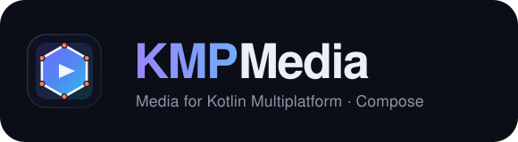
</p>

# KMPMedia

<p align="center">
  <a href="https://central.sonatype.com/artifact/se.solidkey/kmpmedia-lib"></a>
</p>

**A Kotlin Multiplatform media library for Compose** — with a focus on **animated, interactive, and runtime-editable vector SVG**, plus image processing, **animated GIFs**, audio, video, an **on-device compositor with GIF/MP4 export**, and a **motion & action-FX** set, on **Android and iOS**.

Everything renders into native Compose primitives (`Canvas`/`drawScope`), so SVGs are live vectors you can animate, drag, layer, and edit at runtime — not rasterized bitmaps.

---

## Why KMPMedia?

Basic "show an SVG on both platforms" is now a solved problem (Coil 3, Kamel, Compose Multiplatform resources). KMPMedia targets what those still don't do:

| Capability | KMPMedia | Coil 3 (`coil-svg`) | Compose MP resources |
|---|:---:|:---:|:---:|
| Cross-platform SVG (Android + iOS) | ✅ | ✅ | ⚠️ (not Android) |
| Rendered as **live vectors** (not a bitmap) | ✅ | ❌ (rasterized) | ❌ |
| **Runtime SVG animation** (SMIL `<animate>`) | ✅ | ❌ | ❌ |
| **Wrap any static image/SVG → animated** (`OGAnimatedImage`) | ✅ | ❌ | ❌ |
| **Shape-crop** image & video to any shape (circle/triangle/…) | ✅ | ❌ | ❌ |
| **Free-form polygon lasso** — clip to any AI-/hand-drawn outline (`OGPolygonShape`) | ✅ | ❌ | ❌ |
| **Auto-cutout** — turn a segmentation mask into a live lasso (`autoCutoutPolygon`) | ✅ | ❌ | ❌ |
| **Live camera clipped to any shape** (`OGCameraPreview`) | ✅ | ❌ | ❌ |
| **Depth / layer management** — fly over/under + depth-of-field blur + parallax (`Modifier.ogDepth` / `ogParallax`) | ✅ | ❌ | ❌ |
| **Data-defined drawing styles** — JSON `{op}` pipeline → live boil / quantize / pixelate (`OGStyleSpec`) | ✅ | ❌ | ❌ |
| **Interactive / draggable / gesture** layers | ✅ | ❌ | ❌ |
| **Any graphic → a tappable button** — shape-aware tap + press effects (`Modifier.ogButton`) | ✅ | ❌ | ❌ |
| **On-device compositor + export** — layer timeline with keyframes → animated **GIF & H.264 MP4** (`OGComposition`) | ✅ | ❌ | ❌ |
| **Motion & action FX** — slash ribbons, forked lightning, speed-lines, glow / bloom (`com.solidkey.painpoints.fx`) | ✅ | ❌ | ❌ |
| **Data-defined particles & parametric shapes** (`OGParticleSpec` / `OGParametric`) | ✅ | ❌ | ❌ |
| **Live colour looks + blend modes** — data-defined grade (`OGLookSpec` / `Modifier.ogLook`) | ✅ | ❌ | ❌ |
| **Soft / gradient & multi-region masks** (`ogSoftClip` / `OGMultiRegionShape`) | ✅ | ❌ | ❌ |
| **Audio-reactive vectors** — bind live sound (bass/mid/treble/level + beat) to any vector (`OGAudioAnalyzer` / `Modifier.ogAudioReactive`) | ✅ | ❌ | ❌ |
| **Motion design** — draw-on strokes, motion paths (glide + orient along a curve), staggered timing (`OGMotionPath` / `Modifier.ogMotionPath` / `OGStagger`) | ✅ | ❌ | ❌ |
| **Motion dynamics** — natural "feel" filters: spring (lag / overshoot / settle), follow-through, squash &amp; stretch, idle sway (`OGSpring` / `OGFollowChain` / `OGSquash` / `OGSway`) | ✅ | ❌ | ❌ |
| **Cloth** — a 1-D Verlet fabric strip that hangs, holds its length &amp; flutters in the wind: scarf / flag / banner / hair (`OGClothStrip` / `OGClothSpec`) | ✅ | ❌ | ❌ |
| **Cloth sheet** — a 2-D Verlet sheet that drapes over &amp; collides with capsule "poles": tarp / curtain / banner / flag (`OGCloth` / `OGClothCollider`) | ✅ | ❌ | ❌ |
| Bundled image + audio + video suite | ✅ | ❌ | ❌ |

If all you need is a static SVG loaded from the network, a general image loader is the simpler choice. Reach for KMPMedia when you need media to **move, respond, compose, or change at runtime**.

---

## AI-friendly by design

KMPMedia is built to be **generated correctly by AI coding assistants**, not just written by hand:

- **It speaks SVG** — the one graphics format LLMs produce natively as text. An assistant can emit an `<svg>` (including the animated SMIL subset) or a URL, and KMPMedia renders *and animates* it live on both platforms.
- **Declarative, consistent API** — every entry point is `OG…`, and you describe *what* (a shape, an animation set, a cue at a timestamp, a depth) as data. Generated code compiles more often and hallucinates less surface.
- **Agent-ready docs in the repo** — a machine-readable [`llms.txt`](llms.txt) API index and an [AI coding guide](docs/AI_GUIDE.md) with prompt→snippet examples.
- **Grounded in published research** — it's small and dependency-free, but not ad-hoc: every procedural feature maps to a named algorithm/paper (centripetal Catmull-Rom, OKLab, simplex/fBm, fractal lightning, median-cut + Floyd–Steinberg + LZW, Douglas–Peucker, xorshift, …). See [**docs/ACADEMIC_FOUNDATIONS.md**](docs/ACADEMIC_FOUNDATIONS.md).
- **Runtime prompt-driven editing** — [`OGAiVector`](docs/AI_HOOKS.md) is a **stable JSON wire format** (a codec, not an AI SDK) for the library's vector primitives. It hands a model that contract and turns the reply, or a *photo* via a vision model (*image → vector*, v1.25.0), into a live polygon lasso, a multi-region scene cut-out, or an SVG node patch (*"describe → shape / patch"*); an optional centripetal-spline `smoothing` knob rounds a model's faceted points into a clean outline. No AI SDK or networking is pulled into the library, and it works with any model (or a segmentation network that emits vertices).

Today that makes KMPMedia **AI-generatable** *and* **AI-drivable at runtime**, including a full serializable **scene-spec** (`OGSceneSpec`, shipped in v1.25.0). An **MCP server** (an LLM emits validated *data*, not Kotlin, and previews it before writing code) remains on the roadmap to make it fully **AI-ready**.

---

## See it running — the demo app

KMPMedia ships with a full **Compose Multiplatform demo app** (Android + iOS) built directly against this library's source, so every screen is real, readable library code you can lift into your own app. It's the fastest way to see what "animated, interactive, runtime-editable" actually looks like.

> **⏱️ A note on the GIFs' speed.** GIF is a low-frame-rate, palette-limited format, and the shape/path **morph** clips here are *additionally* slowed (~2–3×) on purpose, so the shape-shift is easy to follow in a static browser — **those morph captures are not the real speed.** (The gameplay/feature clips play at real speed.) Running live, every screen animates at your display's refresh rate (**~60fps**) and is smooth, not steppy: each morph resamples its two endpoint outlines *once* (cached) and then only interpolates points per frame — no re-parse, no per-frame allocation. So the slowed morph captures read clear-and-slow on purpose; the actual app is fluid.

<p align="center">
  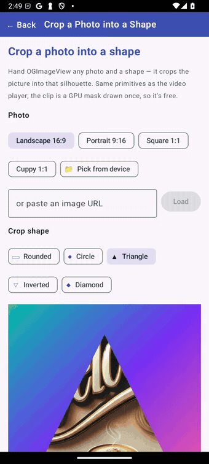
</p>
<sub><b>The core moves, live.</b> Crop a photo into any shape · re-frame a <i>running</i> video into any shape · bring a 100%-static SVG to life with Scale / Rotate / Fade / Slide. Each is one <code>OGImageView</code> / <code>OGAVPlayer</code> / animation-primitive call — the same Compose Multiplatform code on Android &amp; iOS.</sub>

And the flagship **runtime-editable SVG** — one `.svg` parsed *once*, then any node changed by its `id` at runtime, bound to Compose state:

<p align="center">
  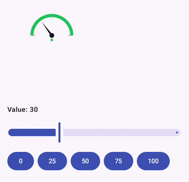
  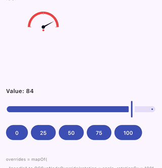
</p>
<sub><b>Runtime-editable SVG, live — Android (left) &amp; iOS (right).</b> One <code>.svg</code> is parsed <i>once</i>; a slider only mutates an <code>overrides</code> map keyed by node <code>id</code> and the same drawing redraws live — the needle rotates and the arc + status dot recolour green→amber→red. No re-parse, identical on both platforms. See <a href="docs/RUNTIME_SVG.md">docs/RUNTIME_SVG.md</a>.</sub>

…and the same mechanism **morphs a path between two shapes** — set a `<path>`'s `pathDataTo` and drive `morphProgress` 0→1 from any Compose animation:

<p align="center">
  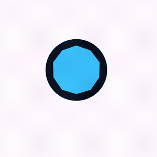
  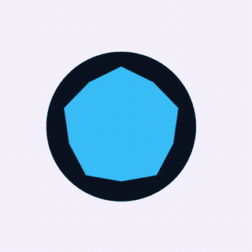
</p>
<sub><b>Path morphing, live — Android (left) &amp; iOS (right).</b> A single node's <code>&lt;path&gt;</code> tweens between a star and a ring and back, forever. Both endpoint <code>d</code> strings are parsed <i>once</i> and cached, so each frame only interpolates points — no re-parse, no allocation churn, built for the "runs in a game at 60fps" bar. Same <code>OGSVGView</code> + <code>overrides</code> path as the gauge above, identical on both platforms. See <a href="docs/RUNTIME_SVG.md">docs/RUNTIME_SVG.md</a>.</sub>

…and the newest — **morph the *clip mask* itself** (v1.10.0). The same idea applied to clipping: the outline that masks a *running* video (or GIF) animates circle → diamond → triangle → lasso while the media plays on:

<p align="center">
  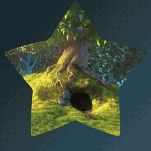
</p>
<sub><b>Morph the clip itself, live — Android.</b> One <code>OGMorphShape</code> drives the mask; the video keeps playing underneath as the outline tweens circle → diamond → triangle → lasso (the dark stage shows the silhouette at the corners). The <i>same</i> <code>Shape</code> feeds <code>OGImageView.clipShape</code> (photos/GIFs), <code>OGPlayerConfig.clipShape</code> (video) and any <code>Modifier.clip</code> — no new surface API. Each endpoint outline is resampled <i>once</i> (cached by shape + size) and only the points are lerped per frame, so it holds 60fps. See <a href="docs/SHAPE_MORPH_CLIPS.md">docs/SHAPE_MORPH_CLIPS.md</a>.</sub>

…and the mask can now also be **soft** and **multi-region** (v1.12.0). A clip no longer has to be one shape with a hard edge: `Modifier.ogSoftClip(shape, feather)` fades a photo/GIF out over a feathered band (a vignette) and `Modifier.ogGradientMask(brush)` fades it along any gradient (edge fade, spotlight) — both surfaced on `OGImageView` as `softEdge` / `maskBrush`; and `OGMultiRegionShape` combines several placed sub-shapes with a path op (union / intersect / difference / xor) so one clip can show two portholes, or a diamond with a circular bite. It's an ordinary `Shape`, so it drops into the same `clipShape` slot for photos, GIFs and video. Soft masks are a single offscreen `BlendMode.DstIn` pass (no blur, no API floor); multi-region combines outlines once per size — both hold 60fps. See [**docs/SOFT_MASKS.md**](docs/SOFT_MASKS.md).

<p align="center">
  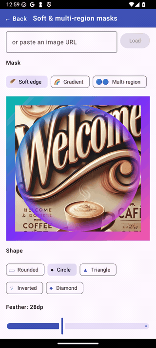
  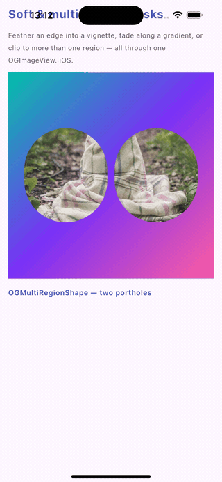
</p>
<sub><b>Soft &amp; multi-region masks, live — Android (left) &amp; iOS (right).</b> One <code>OGImageView</code>: <code>softEdge</code> feathers the clip edge into a vignette, <code>maskBrush</code> fades the photo along a gradient, and <code>OGMultiRegionShape</code> clips it to more than one region (two portholes, or a diamond with a circular bite). Soft masks are one offscreen <code>BlendMode.DstIn</code> pass — no blur, no API floor; multi-region is a path op computed once per size. The <i>same</i> code on both platforms. See <a href="docs/SOFT_MASKS.md">docs/SOFT_MASKS.md</a>.</sub>

…and the newest, the flagship — **compose layered scenes and export them** (v1.13.0). KMPMedia could put one piece of media in one shape; now it composes *several* layers on *one* timeline, animates them with keyframes, previews the result live at 60fps, and exports it to a single **shareable animated GIF** — all authored on device. `OGComposition` stacks image / solid layers, each with animatable x / y / scale / rotation / opacity tracks and any shape clip over a `[startMs, endMs]` window; `OGCompositionView` plays it on the Compose frame clock (or scrubs to any `positionMs`); and `OGComposition.exportGif()` renders every frame offscreen and encodes one looping GIF with a pure-Kotlin encoder — zero dependencies, identical bytes on Android and iOS. **New in v1.14.0:** the same composition also exports to a real **H.264 MP4** with `OGComposition.exportMp4()`, driving the device's own video encoder (Android `MediaCodec` + `MediaMuxer`, iOS `AVAssetWriter`) — still with no third-party dependency, since the compositing and colour maths stay in shared, tested `commonMain`. **No other KMP library does compose-and-export.** See [**docs/COMPOSITOR.md**](docs/COMPOSITOR.md).

<p align="center">
  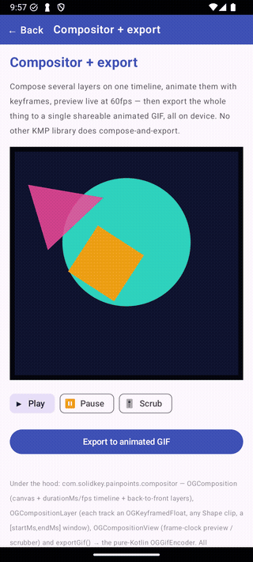
  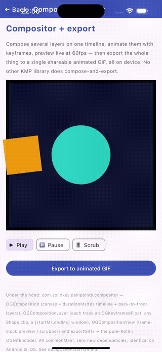
</p>
<sub><b>On-device compositor + export, live — Android (left) &amp; iOS (right).</b> Several solid-colour layers on one <code>OGComposition</code> timeline, each with keyframed x / y / scale / rotation / opacity and a shape clip, previewed at 60fps by <code>OGCompositionView</code>. In the app, <b>Export</b> renders the timeline and encodes it to a single looping animated GIF with the pure-Kotlin <code>OGGifEncoder</code> (median-cut palette + Floyd–Steinberg dithering + LZW, zero deps, so gradients stay band-free) — then plays that exact GIF back through the platform's own decoder, proving it's a real, shareable file. The <i>same</i> code on both platforms. See <a href="docs/COMPOSITOR.md">docs/COMPOSITOR.md</a>.</sub>

<p align="center">
  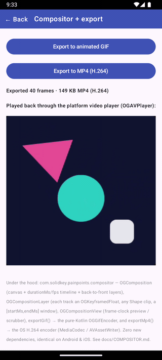
  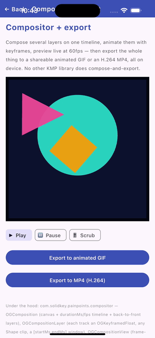
</p>
<sub><b>Same composition, exported to a real H.264 MP4 — Android (left) &amp; iOS (right).</b> The identical keyframed scene, this time rendered by <code>OGComposition.exportMp4()</code> through the device's own video encoder (Android <code>MediaCodec</code> + <code>MediaMuxer</code>, iOS <code>AVAssetWriter</code>) — no third-party dependency. On Android the exported file is played straight back in <code>OGAVPlayer</code>, proving it's a real, shareable <code>.mp4</code>; the iOS capture shows the same export producing a valid H.264 <code>.mp4</code> (standard High profile, 288×288 @ 20fps). The compositing and colour maths (RGB→YUV / BGRA) live in shared, tested <code>commonMain</code>; only the thin encoder is per-platform. <b>New in v1.14.0.</b> See <a href="docs/COMPOSITOR.md">docs/COMPOSITOR.md</a>.</sub>

…and that clipped media is now **interactive** — **grab, drag, pinch-zoom, twist-rotate, fling and spring back** (v1.15.0). `Modifier.ogInteractive(state, hitArea)` makes any composable gesture-driven: it applies the pan / zoom / rotation through a single `graphicsLayer` (a GPU-layer transform, no recomposition, 60fps) and drives it from a custom `awaitEachGesture` loop, with a momentum fling on release and a spring settle back inside its bounds. Pass an `OGHitArea` and the touch is **shape-aware** — a drag only starts inside the clip's silhouette, so the transparent corners of a triangle / circle / lasso fall through instead of grabbing it. Pan limits are a *fraction* of the content size, so one config works at any resolution; the hit-test and clamp maths are unit-tested on JVM + iOS. **No other KMP media library makes a shape-clipped layer physically interactive.** See [**docs/INTERACTIVE.md**](docs/INTERACTIVE.md).

<p align="center">
  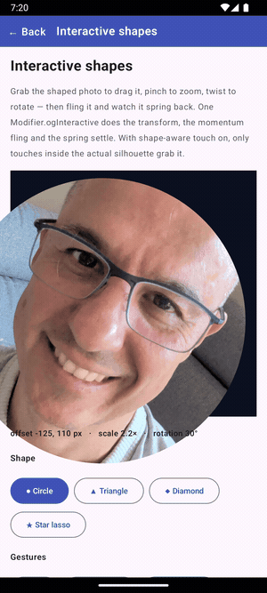
  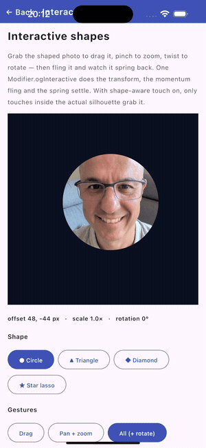
</p>
<sub><b>Interactive shapes, live — Android (left) &amp; iOS (right).</b> The <i>same</i> Compose Multiplatform code: a photo clipped to a shape, made draggable / pinch-zoomable / twist-rotatable by one <code>Modifier.ogInteractive</code>, with a momentum fling and a bouncy spring settle. <code>OGHitArea</code> makes the touch shape-aware (grab the silhouette, not its bounding box). The motion here is driven by a scripted loop so both platforms show the full pan / zoom / rotate / spring identically (the capture tooling can't inject multi-touch); in the app it's your fingers. The transform rides one GPU <code>graphicsLayer</code>, so it holds 60fps; the hit-test and clamp maths are unit-tested on JVM + iOS. <b>New in v1.15.0.</b> See <a href="docs/INTERACTIVE.md">docs/INTERACTIVE.md</a>.</sub>

…and the newest, most-animated additions now have GIFs — captured straight from the demo (Android shown; almost all are pure shared `commonMain` maths drawn by the same Skia engine, so the iOS frame is identical — the two platform-backed exceptions, bloom's blur and styled text's base font, are noted below; run the [demo](https://github.com/SolidKeyAB/kmpmedia-demo/releases) to see any of them live on either OS):

<p align="center">
  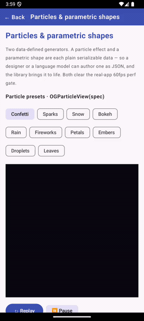
  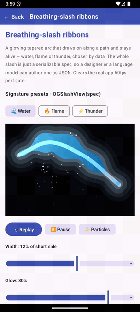
  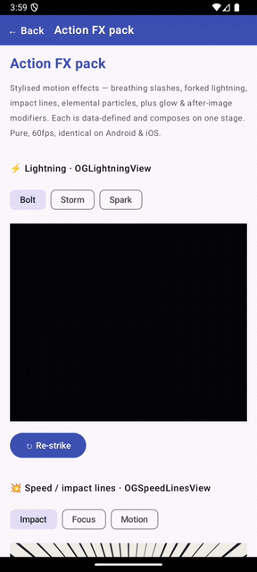
</p>
<sub><b>🎆 Particles &amp; parametric shapes · 🗡️ Breathing-slash ribbons · ⚡ Action-FX pack (forked lightning + speed lines).</b> All data-defined, pure maths, 60fps — Android shown, frame-identical on iOS.</sub>

<p align="center">
  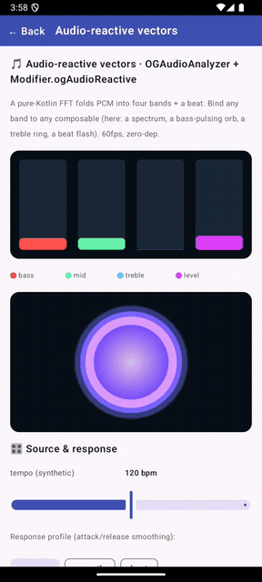
  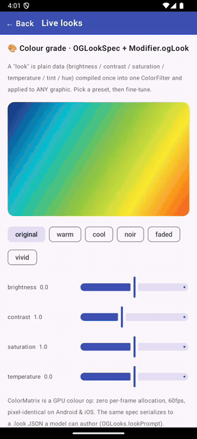
  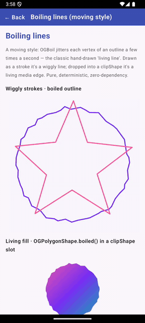
</p>
<sub><b>🎵 Audio-reactive vectors · 🌈 Live looks (colour grade) · 🖊️ Boiling-line style.</b> Each is plain serializable data a model can author; one GPU op per frame — Android shown, identical on iOS.</sub>

<p align="center">
  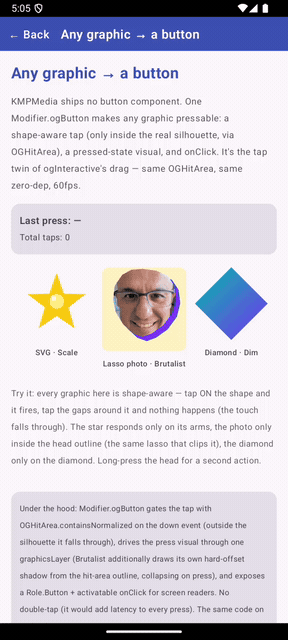
  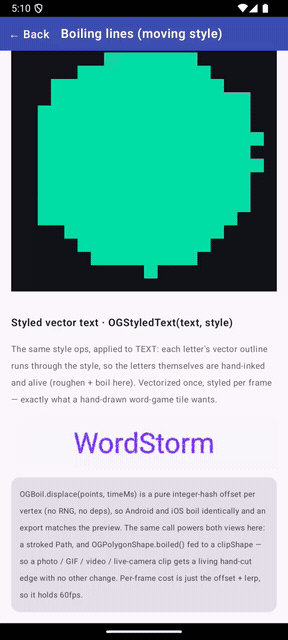
  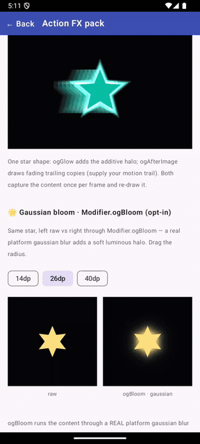
</p>
<sub><b>🔘 Any graphic → a button · 🖋️ Styled vector text · 🌟 Gaussian bloom.</b> Shape-aware press effects (scale / brutalist push-in / dim), hand-inked animated letters, and a real platform gaussian halo — Android shown. The button's press effects are pure shared maths, so they're pixel-identical on iOS. The two platform-backed effects differ slightly: styled text's hand-drawn boil is identical, but the base letterforms use each platform's default sans (Roboto on Android, the iOS system family), and <code>ogBloom</code>'s halo is a real platform gaussian blur (Android <code>RenderEffect</code> 31+ / iOS Skia), so it's visually equivalent rather than pixel-identical.</sub>

<p align="center">
  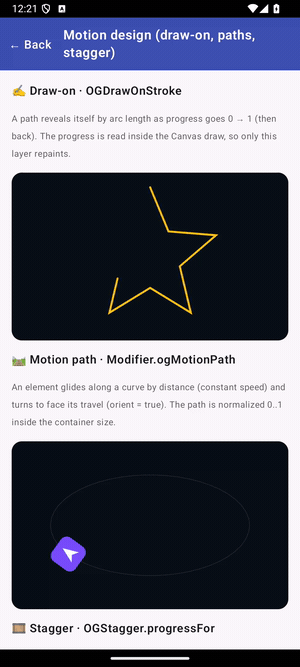
</p>
<sub><b>✍️ Motion design — draw-on, motion paths &amp; stagger.</b> A stroke that draws itself on by arc length, an element gliding + turning along a curve, and staggered group timing — all normalized 0..1, pure arc-length maths, 60fps, same code on Android &amp; iOS. See <a href="docs/MOTION.md">docs/MOTION.md</a>.</sub>

<p align="center">
  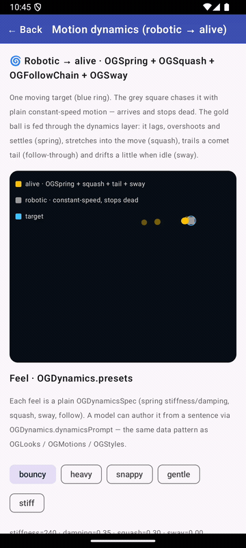
</p>
<sub><b>🌀 Motion dynamics — robotic → alive.</b> The <i>same</i> moving target chased by a robotic twin (constant speed, stops dead) and one fed through the dynamics layer: spring lag / overshoot / settle, squash &amp; stretch, a follow-through comet tail and idle sway, switchable between five feel presets. Pure closed-form maths (so the compositor can scrub + export it), 60fps, same code on Android &amp; iOS. See <a href="docs/MOTION.md">docs/MOTION.md</a>.</sub>

<p align="center">
  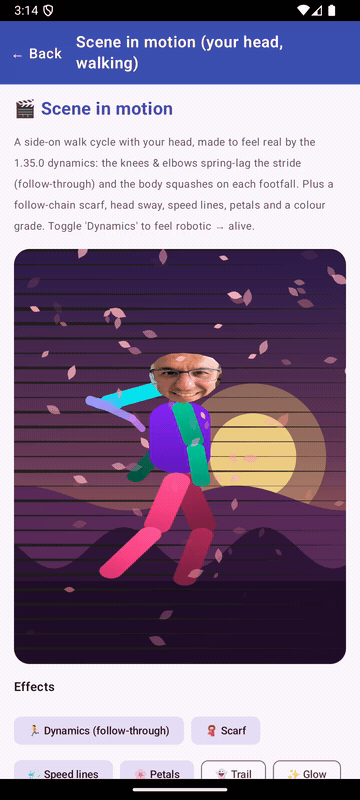
</p>
<sub><b>🎬 Composing it all — a walk cycle at sunset.</b> Not one primitive but many at once: the 1.35.0 dynamics driving a gait (<code>OGSpring</code> follow-through on the knees/elbows + <code>OGSquash</code> footfall), a 1-D <code>OGClothStrip</code> scarf and a 2-D <code>OGCloth</code> flag (v1.37.0) both rippling in the wind, <code>OGSway</code> head drift, <code>OGSpeedLines</code>, <code>OGParticles</code> petals, and a sun that sets as an animated <code>ogLook</code> grade warms then cools the whole frame day → dusk → night — a photo head clipped to a lasso riding along. Every effect here is a shipped library primitive; the rig + sunset choreography are ~demo code. See the demo's 🎬 <i>Scene in motion</i> screen.</sub>

<p align="center">
  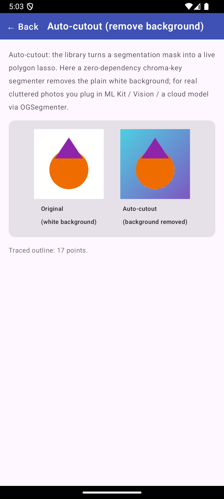
</p>
<sub><b>🪄 Auto-cutout → live lasso.</b> The background is removed and the silhouette traced to a polygon lasso that drops into the same <code>clipShape</code> slot (shown on a synthetic subject so it reproduces without a photo). A still — the result itself doesn't animate.</sub>

Here's the full rundown of this wave (📷 live camera is the one effect not shown here — it needs a real device's camera, so it stays described):

- **🪄 Auto-cutout → live lasso** *(v1.19.0)* — drop a photo and the subject is clipped out: a pluggable `OGSegmenter` seam (plug in ML Kit / Vision / a cloud model) plus a cross-platform mask → lasso tracer (flood-fill → Moore-neighbour trace → Douglas–Peucker simplify) whose output drops straight into the same `clipShape` slot. No ML model is bundled. See [**docs/AUTO_CUTOUT.md**](docs/AUTO_CUTOUT.md).
- **📷 Live camera in any shape** *(v1.22.0)* — `OGCameraPreview(shape, facing)` masks the live camera feed to any shape (a built-in `OGShapeType`, an `OGPolygonShape` lasso, `CircleShape`, …): the AR-sticker primitive, built on the platform camera APIs (Camera2 / AVFoundation) with no third-party dependency. See [**docs/CAMERA.md**](docs/CAMERA.md).
- **🖊️ Data-defined drawing styles** *(v1.23.0)* — a drawing style is now just data: an `OGStyleSpec` is a JSON pipeline of `{op, params}` that `OGStyles.decode()` compiles into a live `OGStyle` applied every frame — **boil** (a living, hand-drawn line), **quantize** (a stepped, stop-motion line) and **pixelate** (a low-res mosaic fill). A designer or a language model can author and share a `.style` pack with no code and no rebuild, mirroring how `OGAiVector` turns a model's JSON into shapes. Zero new dependency; the demo's 🖊️ *Boiling lines* screen (with a live "Style from JSON" editor) dogfoods it. See [**docs/STYLES.md**](docs/STYLES.md).
- **🔘 Any graphic → a button** *(v1.24.0)* — KMPMedia ships no components or theme system, so instead it ships the *bridge*: one modifier, `Modifier.ogButton(hitArea, pressEffect) { onClick() }`, makes any graphic (a photo, an SVG, a lasso-cut cut-out, a `Canvas` drawing) a real, accessible button. It's the **tap twin** of `Modifier.ogInteractive` — both reuse `OGHitArea`, so a tap only counts **inside the silhouette** and the transparent corners fall through. Pick a press effect — `Scale`, `Dim`, `Brutalist` (a pop-art hard-shadow push-in it draws itself) or `None` — add an optional long-press, and it's done. Zero dependency; the demo's 🔘 *Any graphic → a button* screen dogfoods it. See [**docs/BUTTON.md**](docs/BUTTON.md).
- **🎆 Data-defined particles & parametric shapes** *(v1.28.0)* — a particle effect and a vector shape are each plain serializable data: an `OGParticleSpec` (rate, gravity, colour-over-life, shape) compiled once into a `OGParticleView` (a struct-of-arrays sim, no per-frame allocation, deterministic from a seed), and parametric outlines (`star` / `gear` / `flower` / `superellipse` / `blob`) wrapped in an `OGPolygonShape` clipShape. Author-as-JSON, 60fps, same on Android & iOS. See [**docs/PARTICLES.md**](docs/PARTICLES.md) · [**docs/PARAMETRIC_SHAPES.md**](docs/PARAMETRIC_SHAPES.md).
- **🖋️ Styled vector text** *(v1.29.0)* — `OGStyledText` vectorizes a string once and runs each glyph outline through a drawing style (`roughen` / `boil` / `wave` / …) every frame, so the letters are hand-inked and alive — a title card or a word-game tile. See [**docs/STYLES.md**](docs/STYLES.md).
- **⚡ Action-FX pack** *(v1.30.0)* — a `com.solidkey.painpoints.fx` family for composing stylised action scenes: `OGSlashView` (a breathing-slash ribbon — water / flame / thunder by data), `OGLightningView` (forked, fractal lightning), `OGSpeedLinesView` (manga impact lines), elemental particle presets (petals / embers / droplets / leaves), and `Modifier.ogGlow` / `Modifier.ogAfterImage`. Each effect is serializable data; all pure maths, 60fps, frame-identical on Android & iOS — no shaders, no new dependency. See [**docs/SLASH.md**](docs/SLASH.md).
- **🌟 True-gaussian bloom** *(v1.31.0)* — `Modifier.ogBloom(radius, intensity, color?)` redraws a composable through a real platform gaussian blur (Android `RenderEffect` / iOS Skia), blended additively, for a soft luminous halo — the cinematic cousin of the zero-dependency, frame-identical `ogGlow`. Opt-in: the blur needs **Android 31+** (it no-ops to a crisp draw below) and isn't pixel-identical across platforms. This release also repairs a 1.30.0 bug that silently no-op'd `ogGlow` and `ogAfterImage`, so the composite FX modifiers now render correctly. See [**docs/SLASH.md**](docs/SLASH.md).
- **🌈 Live looks** *(v1.32.0)* — a colour grade is just data: an `OGLookSpec` (brightness / contrast / saturation / temperature / tint / hue) compiles once into a single `ColorFilter` you drop on any graphic with `Modifier.ogLook`, plus a per-layer grade + blend modes on the compositor. One GPU colour op, zero per-frame allocation, 60fps, pixel-identical on Android & iOS; a look serializes to a `.look` JSON a model can author (like `OGAiVector` / `OGStyles`). See [**docs/LOOKS.md**](docs/LOOKS.md).
- **🎵 Audio-reactive vectors** *(v1.33.0)* — make any vector react to sound: a pure-Kotlin FFT (`OGFft`) folds PCM into bass / mid / treble / level + a beat flag (`OGAudioAnalyzer`), smoothed with attack/release, and `Modifier.ogAudioReactive` binds a band to any composable (or read it straight into a spec). The capture is a pluggable `OGAudioSource` — a built-in deterministic `OGSyntheticAudioSource` runs it with no mic, and you feed your own mic/music tap on device, so no platform audio or permission enters the library. Zero-dep, 60fps, same code on Android & iOS. See [**docs/AUDIO_REACTIVE.md**](docs/AUDIO_REACTIVE.md).
- **✍️ Motion design** *(v1.34.0)* — three motion-graphics primitives in `com.solidkey.painpoints.motion`: **draw-on** (a stroke or logo that draws itself on by arc length, `OGDrawOnStroke`), **motion paths** (send any element gliding along a curve at constant speed and turning to face its travel, `Modifier.ogMotionPath`), and **stagger** (one timeline → per-element offset timing so a group cascades / waves / pops, `OGStagger`). The path + stagger are plain serializable data (`OGMotions`), the core is pure arc-length maths (O(log n) per lookup, centripetal smoothing, no recomposition), 60fps, same code on Android & iOS. See [**docs/MOTION.md**](docs/MOTION.md).
- **🌀 Motion dynamics** *(v1.35.0)* — the pure-maths "feel" layer of `com.solidkey.painpoints.motion`: an analytic second-order **spring** (`OGSpring` — lag, overshoot, settle; closed-form so the compositor can scrub + export it, which `androidx…spring()` can't), **follow-through** (`OGFollowChain`, a trailing chain for hair / cape / limbs), volume-preserving **squash & stretch** (`OGSquash`) and organic **idle sway** (`OGSway`). The whole feel is data — an `OGDynamicsSpec` with five presets (`bouncy` / `heavy` / `snappy` / `gentle` / `stiff`) a model can author from a sentence (`OGDynamics.dynamicsPrompt`), the same pattern as `OGLooks` / `OGMotions` / `OGStyles`. Pure maths, zero dependency, 60fps, same code on Android & iOS. See [**docs/MOTION.md**](docs/MOTION.md).
- **🧣 Cloth** *(v1.36.0)* — a fabric primitive in `com.solidkey.painpoints.motion`: `OGClothStrip`, a one-dimensional **Verlet** cloth strip pinned at the head that hangs under gravity, stays **inextensible** (four position-based distance-constraint passes, so it swings but never stretches) and flutters in a prevailing wind plus seeded `OGFxNoise` gusts — a scarf, flag, banner or lock of hair. A **fixed internal substep** makes it stable and byte-for-byte deterministic at any frame rate, and `OGCloths.sampleAt(spec, t)` re-simulates to a time so the compositor can scrub + export it. The strip is plain serializable data (`OGClothSpec`) with four ready fabrics (`scarf` / `flag` / `banner` / `hair`) a model can author (`OGCloths.clothPrompt`). Reach for it when something should *hang and flutter*; reach for `OGFollowChain` when something should *stretch and trail*. Zero dependency, 60fps, same code on Android & iOS. See [**docs/MOTION.md**](docs/MOTION.md).
- **🪟 Cloth sheet** *(v1.37.0)* — cloth in two dimensions: `OGCloth`, a 2-D **planar** Verlet sheet (a `cols × rows` grid of masses held by **structural + shear** springs, inextensible) that does the thing the 1-D strip can't — it **drapes over and collides with** `OGClothCollider` capsule "poles" (a line + radius; a circle is a zero-length capsule), so you can throw a tarp over a scaffold bar or fly a flag off a pole. Same fixed-substep determinism (byte-for-byte identical on Android & iOS), four pin modes (`NONE` / `TOP_EDGE` / `TOP_CORNERS` / `LEFT_EDGE`), and the same data-defined, AI-authorable codec (`OGClothMeshSpec` + `OGCloths.meshPreset` / `clothMeshPrompt`, presets `tarp` / `curtain` / `banner-wall` / `sail`) with `OGCloths.sampleAt` for deterministic scrub + export. Deliberately a *planar* media primitive — no 3-D cloth, self-collision, tearing or solver API. Zero dependency, 60fps, same code on Android & iOS. See [**docs/MOTION.md**](docs/MOTION.md).

*(📷 Live camera is the one effect without a GIF here — it needs a real device's camera (there's nothing to film on a headless emulator), so run the [demo](https://github.com/SolidKeyAB/kmpmedia-demo/releases) on a device to see it live.)*

And a whole mini-game built from those same primitives:

<p align="center">
  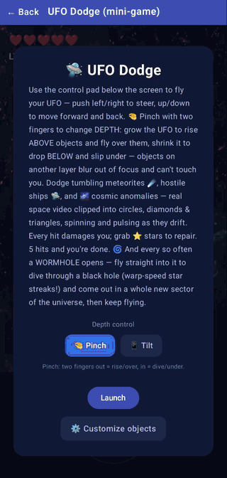
  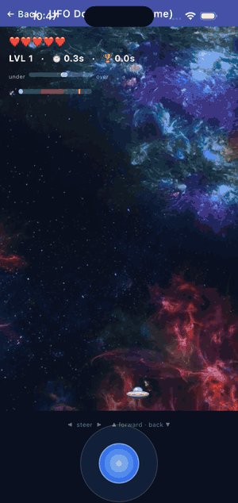
</p>
<sub><b>UFO Dodge, live — Android (left) &amp; iOS (right).</b> The <i>same</i> Compose Multiplatform code on both: a real looping video clipped into the backdrop, SVG sprites animated by the library, and the video's own timeline firing an in-game meteor-storm cue.</sub>

And **animated GIFs** — one `OGImageView` pointed at a `.gif`, playing on both platforms (and clipped into shapes just like a still photo):

<p align="center">
  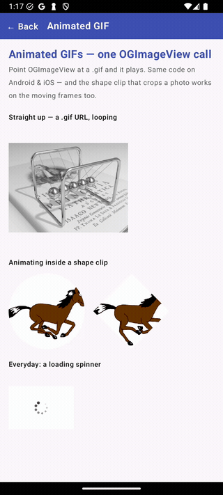
  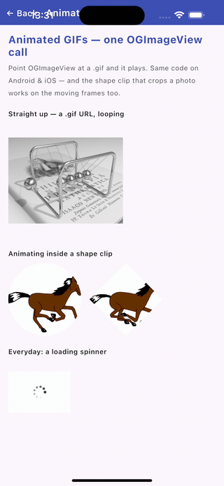
</p>
<sub><b>Animated GIF, live — Android (left) &amp; iOS (right).</b> Each GIF is one <code>OGImageView</code> pointed at a <code>.gif</code> URL — it auto-detects and loops the frames (Android <code>AnimatedImageDrawable</code>, iOS Skia <code>Codec</code>). The <i>same</i> shape clip that crops a still photo animates the moving frames inside a circle / diamond too. See <a href="docs/GIF.md">docs/GIF.md</a>.</sub>

<p>
  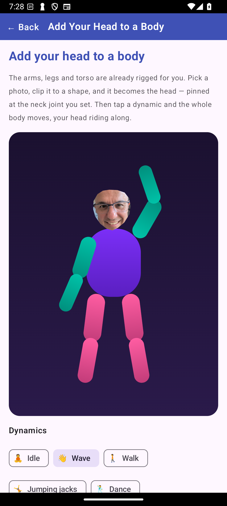
  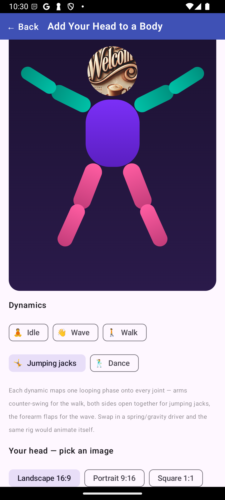
  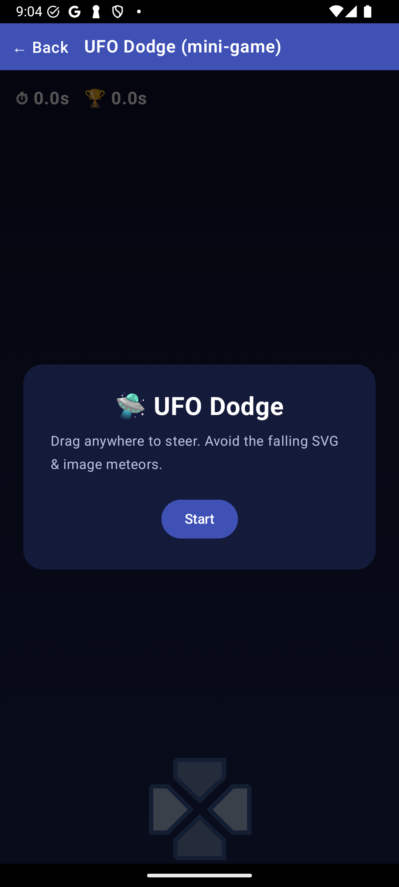
</p>
<sub><b>Android</b> — “Add Your Head to a Body”, then UFO Dodge.</sub>

<p>
  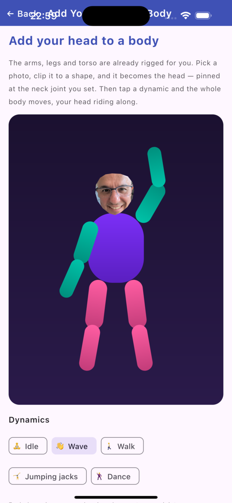
  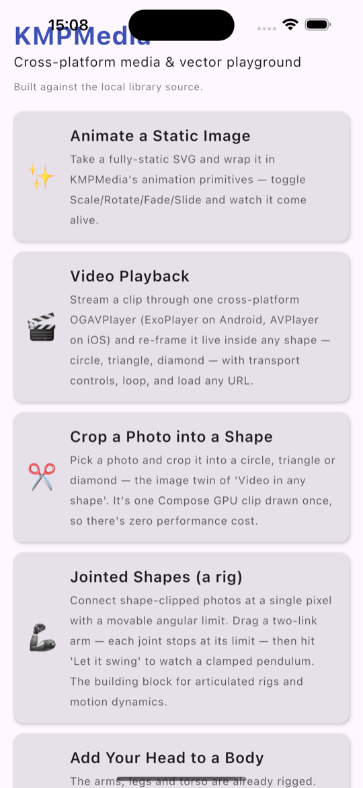
  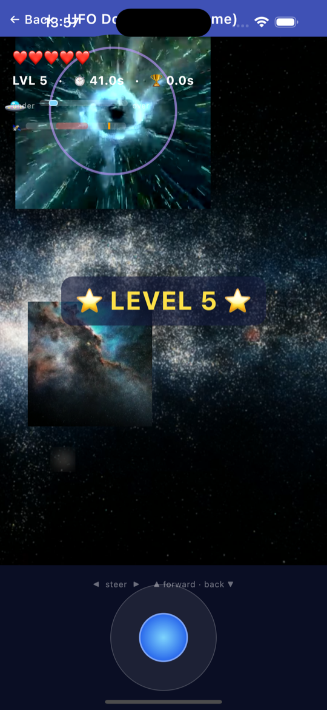
  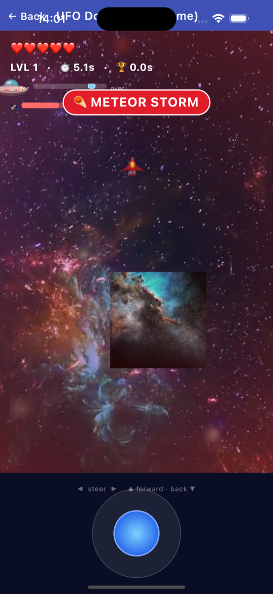
</p>
<sub><b>iOS</b> — the same Compose Multiplatform code on an iPhone simulator: <b>“Add Your Head to a Body”</b> (your photo cut out by the <code>OGPolygonShape</code> head-lasso, exactly as on Android), the home menu, then UFO Dodge (black-hole warp + a meteor-storm cue).</sub>

**What's inside**

- **✨ Animate a Static Image** — take a fully-static SVG (zero `<animate>` tags) and bring it alive with the animation primitives: Scale / Rotate / Fade / Slide, combined live.
- **🎨 Runtime-editable SVG** — load an SVG once, then change any node by `id` at runtime — recolour, rotate, move, reshape its path, or **morph** it smoothly between two shapes — bound to Compose state ([`OGSvgNodeOverride`](docs/RUNTIME_SVG.md)). A live gauge whose needle and zones follow a slider, and a star that tweens into a ring at 60fps, no re-parse. "SVG as a live template", identical on Android & iOS.
- **✂️ Crop a Photo into a Shape** — crop any photo into a circle / triangle / diamond with pinch-to-zoom, drag-to-pan and a 3×3 focal grid — one GPU clip, drawn once, so it's free.
- **🧍 Add Your Head to a Body** — an *already-rigged* body (torso + two arms + two legs, every segment a jointed chain). Drop in a photo and the **✂️ head lasso** ([`OGPolygonShape`](docs/POLYGON_SHAPE.md)) clips out *just the head* — no external editor — pinned at the neck joint you set (size + tilt); or fall back to a circle / triangle / diamond. Then tap **Wave / Walk / Jumping jacks / Dance** and the whole body animates, your head riding along. The head is one `OGImageView` clip; the rig and every dynamic are plain Compose, identical on Android & iOS.
- **🦾 Jointed Shapes** — the building block behind it: shape-clipped photos pinned at one pixel with a movable angular limit, chained into a draggable two-link arm and a clamped pendulum.
- **🎞️ Animated GIF** — point one `OGImageView` at a `.gif` and it plays: looping frames on Android (`AnimatedImageDrawable`) and iOS (Skia `Codec`), the same code. The shape clip that crops a photo animates the moving frames inside a circle / diamond too.
- **🎬 Video Playback** — one cross-platform `OGAVPlayer` (ExoPlayer on Android, AVPlayer on iOS), re-framed live into any shape, with transport controls, loop and load-any-URL.
- **🫧 Morph the clip itself** — the clip *mask* animates circle → diamond → triangle → lasso while a video and a GIF keep playing, all driven by one [`OGMorphShape`](docs/SHAPE_MORPH_CLIPS.md). Clipping moving media to a morphing outline at 60fps, identical on Android & iOS.
- **🪶 Soft & multi-region masks** — feather a photo's edge into a vignette (`softEdge`), fade it along a gradient (`maskBrush`), or clip it to more than one region at once — two portholes, a diamond with a circular bite — with [`OGMultiRegionShape`](docs/SOFT_MASKS.md). Soft edges via one offscreen `DstIn` pass; multi-region via a path op computed once. Same code on Android & iOS.
- **🤹 Interactive shapes** — grab a shape-clipped photo and drag it, pinch to zoom, twist to rotate — then fling it and watch it spring back, with a live offset / scale / rotation HUD. One [`Modifier.ogInteractive`](docs/INTERACTIVE.md) adds the transform + momentum + spring; `OGHitArea` means only touches inside the actual silhouette grab it, not its bounding box. Zero-dep, 60fps, same code on Android & iOS.
- **🪄 Auto-cutout** — drop a photo and the subject is clipped out automatically: a pluggable [`OGSegmenter`](docs/AUTO_CUTOUT.md) seam (ML Kit / Vision / cloud) plus a zero-dependency mask → lasso tracer that feeds the same `clipShape` slot. No bundled ML model.
- **📷 Live camera in any shape** — [`OGCameraPreview(shape, facing)`](docs/CAMERA.md) masks the live camera feed to any shape (built-in / lasso / `CircleShape`), front or back: the AR-sticker primitive, on Camera2 / AVFoundation with no third-party dependency.
- **🖊️ Data-defined drawing styles** — a style is just data: an [`OGStyleSpec`](docs/STYLES.md) JSON pipeline of `{op, params}` (`boil` / `quantize` / `pixelate`) that `OGStyles.decode()` compiles into a live `OGStyle` applied every frame. Author and share `.style` packs with no code; the 🖊️ *Boiling lines* screen has a live "Style from JSON" editor.
- **🔘 Any graphic → a button** — make a graphic tappable with one [`Modifier.ogButton`](docs/BUTTON.md): an SVG star, a lasso-cut photo head and a diamond, each with a different press effect (`Scale` / `Dim` / `Brutalist`) and shape-aware taps — tap the head and it fires; tap a transparent corner of the same photo and it falls through. The tap twin of `ogInteractive`, zero-dep, same code on Android & iOS.
- **🎆 Particles & parametric shapes** — the six particle presets (confetti / sparks / snow / bokeh / rain / fireworks) in [`OGParticleView`](docs/PARTICLES.md) with a live JSON editor, and parametric outlines (star / gear / flower / squircle / blob) spun on the GPU — both author-as-JSON.
- **🗡️ Breathing-slash ribbons** — [`OGSlashView`](docs/SLASH.md) water / flame / thunder slashes with live Width / Glow / Breathing sliders, a JSON editor, and composed droplet / ember / spark particles.
- **⚡ Action FX pack** — forked [`OGLightningView`](docs/SLASH.md) lightning, manga [`OGSpeedLinesView`](docs/SLASH.md) impact lines, elemental particle presets, the `ogGlow` / `ogAfterImage` modifiers, and a composed "action beat" assembling several on one stage.
- **🛸 UFO Dodge (mini-game)** — every sprite is a static SVG animated by the library; crop your own photos into shapes and drop them into the field as live game objects.
- **🎛️ Playground · 🧪 Edge Cases · ⚡ Performance** — load anything from any URL/resource and tune every config live; deliberately broken inputs that prove `onError` fires cleanly; and load-timing / many-layer stress benchmarks with live numbers.

**Run it** — the demo lives in its own [companion repo](https://github.com/SolidKeyAB/kmpmedia-demo) and consumes this library via [`includeBuild`](#use-it-today-from-source):

- **Android** — `./gradlew :androidApp:assembleDebug`, install the APK, or open it in Android Studio. Prebuilt APKs are on the demo repo's [**Releases** page](https://github.com/SolidKeyAB/kmpmedia-demo/releases).
- **iOS** — open the Xcode project and run; a run-script phase recompiles the shared KMP framework on every build, so library changes flow straight through.

## Supported platforms

- ✅ **Android** (`minSdk` per catalog, compiled against JDK 17)
- ✅ **iOS** (`iosArm64`, `iosSimulatorArm64`)

> ℹ️ There are no JVM-desktop, web, or Linux targets in this build.

---

## Installation

> ✅ **Available on Maven Central.** Add the coordinate below and you're set. If you'd rather build against the library source (or need an unreleased change), see [`includeBuild`](#use-it-today-from-source) or GitHub Packages below.

KMPMedia is a Compose Multiplatform library. In your **`settings.gradle.kts`**, make sure the Compose dev repo is available alongside the usual repositories:

```kotlin
dependencyResolutionManagement {
    repositories {
        google()
        mavenCentral()
        maven("https://maven.pkg.jetbrains.space/public/p/compose/dev")
    }
}
```

Then add the dependency to your shared module's **`commonMain`**:

```kotlin
kotlin {
    sourceSets {
        commonMain.dependencies {
            implementation("se.solidkey:kmpmedia-lib:1.37.0")
        }
    }
}
```

<details>
<summary>Alternative: GitHub Packages</summary>

Add the GitHub Packages repository (requires a GitHub token with `read:packages`):

```kotlin
// settings.gradle.kts
dependencyResolutionManagement {
    repositories {
        maven("https://maven.pkg.github.com/SolidKeyAB/kmpmedia") {
            credentials {
                username = providers.gradleProperty("gpr.user").orNull ?: System.getenv("GPR_USER")
                password = providers.gradleProperty("gpr.key").orNull ?: System.getenv("GPR_TOKEN")
            }
        }
    }
}
```
</details>

<details id="use-it-today-from-source">
<summary>Alternative: build from source (<code>includeBuild</code>)</summary>

To hack on the library itself or consume an unreleased change, depend on a local checkout instead of Maven Central — this is exactly how the demo app uses it:

```kotlin
// settings.gradle.kts of the consuming project
includeBuild("../KMPMedia") // path to your local clone
```
```kotlin
// consuming module's build.gradle.kts
commonMain.dependencies {
    implementation("se.solidkey:kmpmedia-lib")
}
```
</details>

---

## Quick start

### Render an SVG

```kotlin
import com.solidkey.painpoints.image.svg.OGSVGView
import com.solidkey.painpoints.image.loading.OGSvgUrlType

OGSVGView(
    source = OGSvgUrlType("https://example.com/logo.svg"),
    width = 240f,
    height = 240f,
    onError = { message -> /* handle load/parse errors */ },
)
```

Sources can also be local files or bundled resources:

```kotlin
OGSvgFileType("/path/to/icon.svg")
OGSvgResourceFileType("icon.svg")
```

### Animate an SVG (SMIL `<animate>`)

```kotlin
import com.solidkey.painpoints.image.svg.animation.OGSVGAnimationPlayer

OGSVGAnimationPlayer(
    source = OGSvgResourceFileType("spinner.svg"),
    width = 120f,
    height = 120f,
    isPlaying = true,
    loop = true,
    onError = { /* ... */ },
)
```

### Turn any static image into an animated one

`OGAnimatedImage` wraps any source — a photo, or even a plain SVG with **no** `<animate>` tags — and animates it at runtime. The source file is never modified; the motion comes entirely from the wrapper.

```kotlin
import com.solidkey.painpoints.image.animating.OGAnimatedImage
import com.solidkey.painpoints.image.animating.OGAnimationType
import com.solidkey.painpoints.image.loading.OGImageUrlType

OGAnimatedImage(
    source = OGImageUrlType("https://example.com/logo.png"),
    animations = setOf(OGAnimationType.SCALE, OGAnimationType.ROTATE), // SCALE / ROTATE / FADE / TRANSLATE
    durationMillis = 1200,
    intensity = 1f,
    onError = { /* ... */ },
)
```

### Display and transform an image

```kotlin
import com.solidkey.painpoints.image.OGImageView
import com.solidkey.painpoints.image.loading.OGImageUrlType

OGImageView(
    source = OGImageUrlType("https://example.com/photo.jpg"),
    draggable = true,
    onEventTriggered = { event, id -> /* layer interaction events */ },
    onError = { /* ... */ },
)
```

Crop the photo into a shape (circle, triangle, diamond, …) with a GPU clip — drawn once, no bitmap cost:

```kotlin
import androidx.compose.foundation.layout.size
import androidx.compose.ui.Alignment
import androidx.compose.ui.layout.ContentScale
import androidx.compose.ui.unit.dp
import com.solidkey.painpoints.shape.OGShapeType

OGImageView(
    source = OGImageUrlType("https://example.com/portrait.jpg"),
    modifier = Modifier.size(220.dp),
    displayShape = OGShapeType.CIRCLE,   // CIRCLE / TRIANGLE_UP / TRIANGLE_DOWN / DIAMOND / SQUARE / RECTANGLE
    contentScale = ContentScale.Crop,
    alignment = Alignment.TopCenter,     // which region stays visible when the photo is over-scaled
    onEventTriggered = { _, _ -> },
    onError = { /* ... */ },
)
```

> The same shape-crop applies to video — a built-in shape via `OGAVPlayer(config = OGPlayerConfig(displayShape = OGShapeType.CIRCLE))`, or a **free-form lasso** via `OGPlayerConfig(clipShape = OGPolygonShape.of(...))` (the same `clipShape` override as images).

Need to keep only an *arbitrary* region — a head, a logo, a hand-drawn area? Clip to a **free-form polygon lasso** instead of a built-in shape. The outline is just a list of normalized `0..1` vertices joined by line segments, so an AI/segmentation model or an on-image finger-draw can produce it directly — no external editor:

```kotlin
import com.solidkey.painpoints.shape.OGPolygonShape

OGImageView(
    source = OGImageResourceFileType("portrait", OGImageFormat.JPEG),
    modifier = Modifier.size(220.dp),
    contentScale = ContentScale.Crop,
    clipShape = OGPolygonShape.of(          // vertices in 0..1 space (top-left origin), any count ≥ 3
        0.48f to 0.02f, 0.86f to 0.22f, 0.84f to 0.54f,
        0.48f to 0.83f, 0.16f to 0.53f, 0.15f to 0.22f,
    ),                                      // ← clips to exactly this outline; see docs/POLYGON_SHAPE.md
    onEventTriggered = { _, _ -> },
    onError = { /* ... */ },
)
```

### Play an animated GIF

Point `OGImageView` at a `.gif` and it plays — no extra API. The frames animate on **both platforms** (previously the image path only ever showed the first frame). Everything else about `OGImageView` still applies: `contentScale`, `alignment`, and shape-crop / lasso clipping all work on the moving image.

```kotlin
import com.solidkey.painpoints.image.OGImageView
import com.solidkey.painpoints.image.loading.OGImageUrlType

// A .gif URL (or file path) auto-detects and loops.
OGImageView(
    source = OGImageUrlType("https://example.com/loading.gif"),
    onEventTriggered = { _, _ -> },
    onError = { /* ... */ },
)
```

Want direct control over looping / speed, or to feed the animation into your own `Image`? Use the underlying painter:

```kotlin
import androidx.compose.foundation.Image
import com.solidkey.painpoints.image.gif.rememberOGAnimatedPainter
import com.solidkey.painpoints.source.OGSource

val painter = rememberOGAnimatedPainter(
    source = OGSource.Url("https://example.com/loading.gif"),
    loop = true,
    speed = 1.5f,          // iOS honours speed; Android plays at native rate
)
painter?.let { Image(painter = it, contentDescription = null) }
```

> **How it works** — Android decodes into the platform's self-animating `AnimatedImageDrawable` (API 28+; the static first frame on API 24–27). iOS decodes every frame with Skia's `Codec` and cycles them honouring per-frame delays and `speed`. See [docs/GIF.md](docs/GIF.md).

See [**docs/POLYGON_SHAPE.md**](docs/POLYGON_SHAPE.md) for the full API and how the demo's "Add Your Head to a Body" uses it to cut out a head.

### Play video / audio

```kotlin
import com.solidkey.painpoints.video.playing.OGAVPlayer
import com.solidkey.painpoints.video.playing.OGAVPlayerAction
import com.solidkey.painpoints.video.loading.OGVideoUrlType

val result = OGAVPlayer(
    action = OGAVPlayerAction.PLAY,   // PLAY / PAUSE / STOP
    source = OGVideoUrlType("https://example.com/clip.mp4"),
    onError = { error -> /* DAVPlayerError */ },
)
```

### Depth / layers — fly over/under + depth-of-field

*New in 1.1.0.* Give any content a `depth` (`0f` = far/behind, `1f` = near/front) relative to a **focal plane**, and KMPMedia derives all three depth effects from that one number: **z-order** (fly over/under), a **depth-of-field** blur + dim that grows with distance from focus, and an optional **parallax scale**.

The easy path — a field of objects that share one focal plane; each child just states its own depth:

```kotlin
import com.solidkey.painpoints.depth.OGDepthField
import com.solidkey.painpoints.depth.OGDepthObject
import com.solidkey.painpoints.depth.OGDepthConfig

OGDepthField(focalDepth = 0.5f) {                    // 0.5 is the plane in sharp focus
    OGDepthObject(depth = 0.1f) { Backdrop() }       // far   → behind + blurred
    OGDepthObject(depth = 0.5f) { Subject() }        // in focus → crisp
    OGDepthObject(depth = 0.9f, config = OGDepthConfig.Video) {
        OGAVPlayer(...)                              // near, in front — Video preset: dim, no blur
    }
}
```

Or drop it onto any single composable:

```kotlin
import com.solidkey.painpoints.depth.ogDepth

OGImageView(..., modifier = Modifier.ogDepth(depth = 0.2f, focalDepth = 0.5f))
```

Tune it with `OGDepthConfig(maxBlur, minAlpha, dimFalloff, blurContent, depthScale)`; use `OGDepthConfig.Video` for video/native surfaces (dim + z-order, no blur — a `RenderEffect` blur over a `TextureView`/`AVPlayerLayer` is unreliable). In focus with defaults it applies **only** `zIndex` (no extra layer). Full perf + compatibility analysis in [`docs/DEPTH_LAYER.md`](docs/DEPTH_LAYER.md).

### Generate or patch a vector from a prompt (AI interop)

*New in 1.11.0.* KMPMedia's vector primitives are just data, so a language model can produce them. `OGAiVector` is a **provider-agnostic** JSON interop layer: it hands a model the exact contract with `polygonPrompt(...)` / `svgPatchPrompt(...)`, and turns the reply back into a live clip shape or SVG patch — tolerant of the code fences and prose models add. **No AI SDK or networking is pulled into the library**; you own the model and the call.

```kotlin
import com.solidkey.painpoints.ai.OGAiVector

// describe → clip region: the model's reply becomes an OGPolygonShape for any clipShape
val prompt = OGAiVector.polygonPrompt("the outline of a five-pointed star")
val star = OGAiVector.decodePolygonOrNull(myLlm.complete(prompt))   // your model, your call

// describe → SVG patch: constrain the model to the ids that exist, apply the result live
val patch = OGAiVector.svgPatchPrompt("point the needle to 80% and turn the arc amber",
                                      nodeIds = listOf("needle", "arc"))
OGSVGView(source = OGSvgResourceFileType("gauge.svg"), width = 240f, height = 240f,
          overrides = OGAiVector.decodeSvgPatchOrNull(myLlm.complete(patch)) ?: emptyMap())

// image → vector (new in 1.25.0): hand a VISION model a photo/frame, get editable vectors back
val imgPrompt = OGAiVector.imageToVectorPrompt(hint = "trace the person", imageInfo = OGImageInfo.of(photo))
val cutout = OGAiVector.decodePolygonOrNull(myVisionLlm.complete(imgPrompt, photo.toBase64Png()))
```

`encodePolygon` / `encodeSvgPatch` / `encodeScene` go the other way (persist a lasso/scene, seed a prompt with the current state). *New in 1.25.0:* `imageToVectorPrompt(...)` + `decodeScene(...)` turn a photo (or a live frame) into editable vector shapes via any **vision** model — you attach the image with `ImageBitmap.toBase64Png()`, and the library still makes **no** network call. All of it runs at generate/patch time, never per frame. See [`docs/AI_HOOKS.md`](docs/AI_HOOKS.md).

### Apply a data-defined drawing style

*New in 1.23.0.* A drawing style is just data — a JSON pipeline of `{op, params}`. `OGStyles.decode(...)` compiles it **once** into a live `OGStyle`; `apply` it each frame with a rising `timeMs`. The ops are `boil` (the living hand-drawn line), `quantize` (a stepped line) and `pixelate` (a low-res sprite fill); a designer or a model can author and share a `.style` pack with no code.

```kotlin
import com.solidkey.painpoints.style.OGStyles

val style = OGStyles.decode(
    """{"name":"pixel sprite","ops":[
         {"op":"boil","amplitude":0.03,"boilFps":10},
         {"op":"pixelate","resolution":20}
       ]}""",
)

val frame = style.apply(outline, timeMs)   // outline: List<OGPoint> in 0..1 space
if (frame.isPixelated) { /* draw frame.pixelSize squares at frame.pixels */ }
else                   { /* stroke or fill frame.outline */ }
```

Or give a media clip a living, hand-cut edge — a boiled `OGPolygonShape` drops into any `clipShape` slot, recreated each frame from a rising time:

```kotlin
import com.solidkey.painpoints.style.OGBoil
import com.solidkey.painpoints.style.boiled

OGImageView(
    source = OGImageUrlType("https://example.com/photo.jpg"),
    clipShape = OGPolygonShape(outline).boiled(OGBoil(amplitude = 0.02f), timeMs),
    onEventTriggered = { _, _ -> },
    onError = { /* ... */ },
)
```

`OGStyles.stylePrompt("a nervous pencil sketch")` hands any model the exact JSON contract, so a style can be AI-authored too. See [`docs/STYLES.md`](docs/STYLES.md).

### Turn any graphic into a button

*New in 1.24.0.* `Modifier.ogButton` makes any graphic a real, accessible, shape-aware button — no UI component, no theme system. Pass an `OGHitArea` matching the clip and only taps **inside the silhouette** count; the transparent corners fall through. Pick a press effect and you're done.

```kotlin
import com.solidkey.painpoints.gesture.ogButton
import com.solidkey.painpoints.gesture.OGHitArea
import com.solidkey.painpoints.gesture.OGPressEffect

OGImageView(
    source = photo,
    clipShape = headLasso,                           // the visible cut-out
    modifier = Modifier
        .size(160.dp)
        .ogButton(
            hitArea = OGHitArea.polygon(headLasso),  // only the head is tappable
            pressEffect = OGPressEffect.Brutalist(),  // pop-art hard-shadow push-in
            onLongClick = { showOptions() },
        ) { open() },
    onEventTriggered = { _, _ -> },
    onError = { /* ... */ },
)
```

It's the **tap twin** of `Modifier.ogInteractive` (the drag half) — both reuse `OGHitArea`. Other press effects: `OGPressEffect.Scale()` (a squeeze), `OGPressEffect.Dim()` (a fade), `OGPressEffect.None`. See [`docs/BUTTON.md`](docs/BUTTON.md).

---

## SVG feature support

The SVG engine is a pure-Kotlin parser + renderer. Honest status:

**Supported**
- Path commands `M L H V C Q Z` and arcs (`A`, approximated with béziers)
- Shapes: `rect` (incl. `rx`/`ry`), `circle`, `ellipse`, `line`, `polygon`, `polyline`
- `<g>`, `<use>`, `<symbol>`
- Linear & radial gradients, patterns
- Transforms: `translate`, `scale`, `rotate`, `skewX/Y`, `matrix`
- SMIL animation (`<animate>`) and interactive/draggable layers

**Partial / not yet supported**
- Fill/stroke opacity, `<clipPath>`, `<mask>`
- `<text>` / `<tspan>`
- `<image>`

Anything not listed above as working should be treated as unsupported for now.

---

## Status

Pre-1.0 in spirit — the SVG animation/interaction layer is the actively developed core; the audio/video/image pieces are functional wrappers over platform players. See the [CHANGELOG](CHANGELOG.md) for release history.

## License

[MIT](https://opensource.org/licenses/MIT) © SolidKey AB
